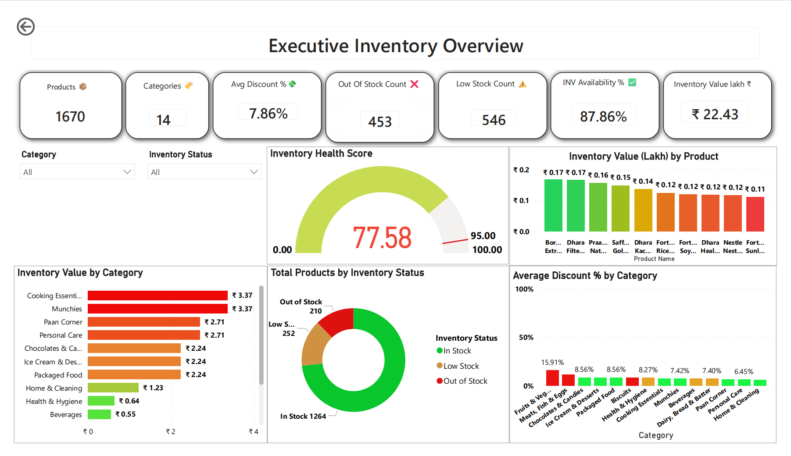
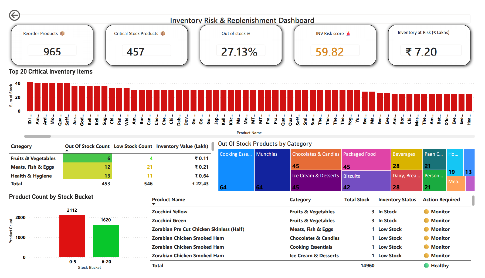

# Retail Inventory Intelligence Solution

## Project Overview

This project is an end-to-end Inventory Intelligence Solution developed using Power BI.

The dashboard helps inventory managers monitor inventory health, identify stock risks, optimize replenishment decisions, and gain product-level intelligence through interactive drillthrough analysis.

---

## Business Problem

Retail inventory teams often struggle with:

* Stockouts
* Low-stock visibility
* Inventory risk monitoring
* Product-level investigation
* Delayed replenishment decisions

This solution provides centralized inventory visibility and supports data-driven inventory management.

---

## Tools & Technologies

* Power BI
* Power Query
* DAX
* Microsoft Excel

---

# Dashboard Pages

## 1. Executive Inventory Overview

### Key Features

* Inventory Health Score
* Inventory Availability %
* Category Performance Analysis
* Inventory Value Analysis
* Inventory Status Monitoring

---

## 2. Inventory Risk & Replenishment Dashboard

### Key Features

* Critical Inventory Monitoring
* Inventory Risk Score
* Inventory at Risk Analysis
* Reorder Product Identification
* Stock Bucket Analysis

---

## 3. Product Intelligence Center

### Key Features

* Drillthrough Analysis
* Product Health Monitoring
* Dynamic Recommendation Engine
* Product Insight Generation
* Product-Level Inventory Intelligence

---

## 4. Executive Recommendations & Business Insights

### Key Features

* Key Findings
* Business Recommendations
* Action Matrix
* Executive Summary
* Decision Support Framework

---

# Key Business Insights

* Inventory Availability: 87.86%
* Out of Stock Products: 453
* Low Stock Products: 546
* Inventory Value: ₹22.43 Lakhs
* Inventory at Risk: ₹7.20 Lakhs

---

# Skills Demonstrated

### Power BI

* Data Modeling
* Dashboard Design
* Drillthrough Analysis

### DAX

* Inventory Health Score
* Inventory Risk Score
* Inventory Availability %
* Product Recommendation Engine

### Business Intelligence

* Inventory Analytics
* Data Storytelling
* Executive Reporting
* Decision Support

---

# Business Recommendations

1. Prioritize replenishment of out-of-stock products.
2. Establish automated reorder triggers.
3. Monitor inventory-at-risk categories.
4. Optimize discount strategies.
5. Review critical inventory items regularly.

---

# Project Outcome

The dashboard provides inventory managers and business stakeholders with a centralized platform for inventory monitoring, inventory risk identification, replenishment planning, and executive decision support.

---

## About the Developer

**Sakthi Sivakumar**

Inventory Management Professional transitioning into Data Analytics.

Skills:

Power BI • DAX • Power Query • Excel • SQL
