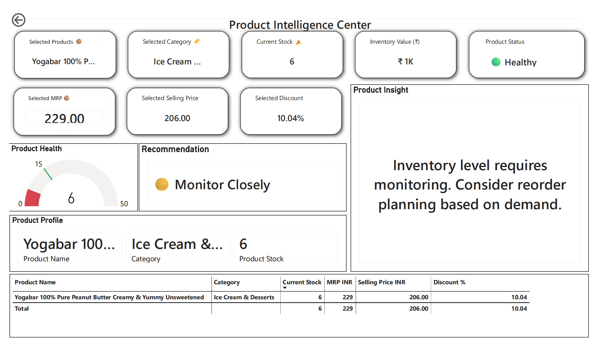
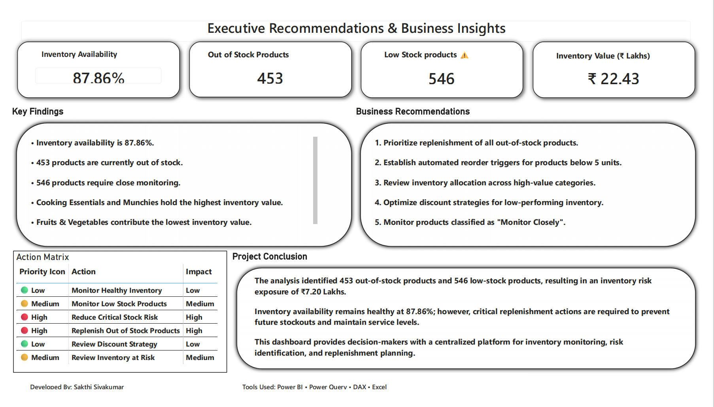

# 📦 Retail Inventory Intelligence Solution


## 📖 Project Overview

This project is an end-to-end **Inventory Intelligence Solution** developed using **Power BI** to support inventory monitoring, stock risk identification, replenishment planning, product intelligence, and executive decision-making.

The dashboard transforms raw retail inventory data into actionable business insights through interactive visualizations, advanced DAX measures, drillthrough analysis, and executive recommendations.

---

# 🚀 Project Highlights

✅ 1,670 Products Analyzed

✅ 14 Product Categories

✅ Inventory Health Score Framework

✅ Inventory Risk Assessment Model

✅ Product-Level Drillthrough Analysis

✅ Dynamic Recommendation Engine

✅ Executive Business Insights Dashboard

✅ Replenishment & Risk Monitoring Solution

---

# 🎯 Business Problem

Retail inventory teams frequently face challenges such as:

* Product stockouts
* Low-stock visibility
* Inventory risk exposure
* Delayed replenishment decisions
* Product-level investigation difficulties
* Lack of centralized inventory reporting

This solution addresses these challenges through a centralized inventory intelligence platform built in Power BI.

---

# 🛠️ Tools & Technologies

| Tool        | Purpose                       |
| ----------- | ----------------------------- |
| Power BI    | Dashboard Development         |
| Power Query | Data Transformation           |
| DAX         | KPI & Business Logic Creation |
| Excel       | Source Data Preparation       |

---

# 📂 Repository Structure

```text
zepto-retail-inventory-intelligence-dashboard
│
├── assets
│   ├── Page1_Executive_Overview.png
│   ├── Page2_Risk_Replenishment.png
│   ├── Page3_Product_Intelligence.png
│   └── Page4_Executive_Insights.png
│
├── dashboard
│   └── Retail Inventory optimization Dashboard.pbix
│
├── reports
│   ├── Retail Inventory optimization Dashboard.pdf
│   └── Zepto_Retail_Inventory_Intelligence_Report.pdf
│
└── README.md
```

---

# 📊 Dashboard Preview

## 1️⃣ Executive Inventory Overview


### Key Features

* Inventory Availability Monitoring
* Inventory Health Score
* Inventory Value Analysis
* Category Performance Tracking
* Stock Status Distribution
* Discount Analysis

---

## 2️⃣ Inventory Risk & Replenishment Dashboard


### Key Features

* Critical Inventory Monitoring
* Inventory Risk Score
* Inventory at Risk Analysis
* Reorder Product Identification
* Stock Bucket Analysis
* Category-Level Risk Assessment

---

## 3️⃣ Product Intelligence Center



### Key Features

* Product-Level Drillthrough Analysis
* Product Health Monitoring
* Dynamic Recommendation Engine
* Product Insight Generation
* Pricing & Discount Analysis
* Product Intelligence Framework

---

## 4️⃣ Executive Recommendations & Business Insights



### Key Features

* Executive Summary
* Business Recommendations
* Action Matrix
* Key Findings
* Strategic Inventory Insights
* Decision Support Framework

---

# 📈 Key Business Insights

| KPI                    |        Value |
| ---------------------- | -----------: |
| Total Products         |        1,670 |
| Categories             |           14 |
| Inventory Availability |       87.86% |
| Out of Stock Products  |          453 |
| Low Stock Products     |          546 |
| Inventory Value        | ₹22.43 Lakhs |
| Inventory at Risk      |  ₹7.20 Lakhs |

---

# 🧠 DAX Measures & Business Logic

The project includes several custom DAX measures:

* Inventory Availability %
* Inventory Health Score
* Inventory Risk Score
* Inventory At Risk
* Product Recommendation Engine
* Product Insight Measure
* Inventory Status Classification
* Stock Bucket Classification

These measures convert transactional inventory data into actionable business intelligence.

---

# 💡 Business Recommendations

### High Priority

* Replenish all out-of-stock products immediately.
* Reduce inventory risk exposure across critical categories.
* Establish automated reorder thresholds.

### Medium Priority

* Monitor low-stock products regularly.
* Optimize inventory allocation by category.
* Review inventory-at-risk segments.

### Strategic Priority

* Improve demand forecasting.
* Implement proactive replenishment planning.
* Enhance inventory visibility through centralized reporting.

---

# 🎓 Skills Demonstrated

### Power BI

* Interactive Dashboard Design
* Drillthrough Navigation
* KPI Development
* Executive Reporting

### DAX

* Advanced Business Measures
* Inventory Classification Logic
* Recommendation Engine Development

### Business Intelligence

* Inventory Analytics
* Risk Analysis
* Data Storytelling
* Decision Support

### Data Preparation

* Data Cleaning
* Data Transformation
* Business Rule Implementation

---

# 📌 Project Outcome

The solution provides inventory managers and business stakeholders with a centralized platform for:

* Inventory Health Monitoring
* Stock Risk Identification
* Replenishment Planning
* Product Intelligence Analysis
* Executive Decision Support

This project demonstrates the practical application of Power BI in solving real-world inventory management challenges.

---

# 👨‍💻 About the Developer

**Sakthi Sivakumar**

Inventory Management Professional transitioning into Data Analytics.

### Skills

Power BI • DAX • Power Query • Excel • SQL • Inventory Analytics

### Career Focus

Inventory Analyst | Supply Chain Analyst | Data Analyst | Business Intelligence

---

⭐ If you found this project valuable, consider giving the repository a star.
